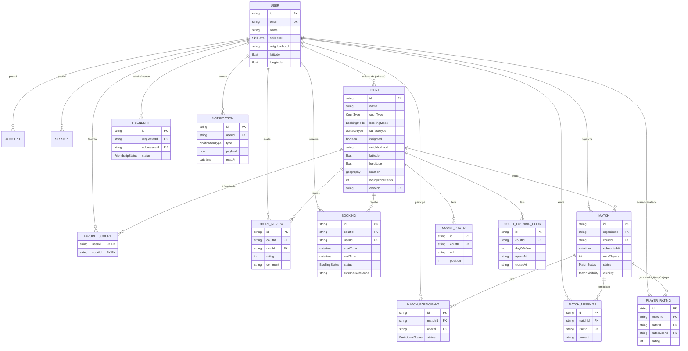

# Diagrama ER — Etapa 2

Modelo de dados completo em `prisma/schema.prisma`. Diagrama abaixo (renderiza no GitHub e em qualquer visualizador Mermaid).

## Decisões de modelagem

**Geolocalização híbrida (`latitude`/`longitude` + `location` PostGIS).**
Guardamos `latitude`/`longitude` como `Float` simples — o Prisma Client lê/escreve neles normalmente (mapa, formulários). A coluna `location` (`geography(Point,4326)`) é mantida em sincronia automaticamente por um trigger de banco (`sync_court_location`) e serve só para buscas de proximidade eficientes (`ST_DWithin`, `ORDER BY location <-> ponto`) via SQL raw na camada de infraestrutura, com índice GIST. Vantagem: Prisma Client continua 100% tipado para o CRUD comum, e a busca geoespacial fica isolada na camada `infrastructure` sem vazar SQL para o resto da aplicação. Desvantagem: qualquer novo caminho que grave `Court` direto no banco (fora do trigger) precisa lembrar de popular lat/lng — mitigado porque o trigger dispara em qualquer INSERT/UPDATE dessas colunas, independente da origem.

**3 tipos de quadra, resolvidos por dois campos ortogonais.**
`courtType` (`PUBLIC_OFFICIAL` / `PUBLIC_UNOFFICIAL` / `PRIVATE`) descreve a natureza da quadra; `bookingMode` (`OFFICIAL_INTEGRATION` / `INTERNAL` / `INFORMATIONAL`) descreve como a _reserva_ é tratada. Separar os dois evita um enum combinatório e permite, por exemplo, uma quadra pública ganhar integração oficial futuramente sem mudar seu `courtType`.

**`Booking` só existe quando faz sentido reservar.**
Quadras `INFORMATIONAL` não geram linhas em `Booking` — a UI mostra `bookingInstructions`/`officialBookingUrl` em vez de um calendário. Isso evita modelar reservas "falsas" para quadras sem agenda real.

**Constraint de não sobreposição (`Booking_no_overlap`).**
Um `EXCLUDE USING gist` garante, no nível do banco, que a mesma quadra não tenha duas reservas `PENDING`/`CONFIRMED` com horários sobrepostos — evita condições de corrida que uma checagem só na aplicação não garantiria sob concorrência.

**`PlayerRating` é sobre o jogador, `CourtReview` é sobre a quadra.**
São conceitos diferentes (avaliação entre jogadores após uma partida vs. avaliação de uma quadra) e por isso vivem em tabelas separadas, cada uma com sua própria unicidade (`@@unique`) evitando avaliações duplicadas.

**Tabelas de auth (`Account`, `Session`, `VerificationToken`) já seguem o schema esperado pelo adapter Prisma do NextAuth**, antecipando a Etapa 3 sem exigir migração de dados depois.
